# VPN Site-to-Site Basada en Políticas — IPSec IKEv1

**Estudiante:** Junior Javier Santos Pérez  
**Matrícula:** 2024-1599  
**Plataforma:** PNETLab  

Link video:  https://www.youtube.com/watch?v=OHtuGFEz7ww 


Enlace GitHub: https://github.com/juniorjaviersantosperez/IPSec-IKEv1-Configure-una-VPN-site-to-site-punto-a-punto-basado-en-polticas.git 


---

## Objetivo

Configurar una VPN Site-to-Site punto a punto basada en políticas (Policy-Based) utilizando IPSec con IKEv1, estableciendo un canal cifrado entre dos sitios remotos a través de Internet. El objetivo es garantizar la **confidencialidad**, **integridad** y **autenticación** del tráfico entre la LAN A (`10.15.99.0/24`) y la LAN B (`192.168.99.0/24`), de manera que los hosts de ambas redes puedan comunicarse de forma segura como si estuvieran en la misma red privada.

En una VPN basada en políticas, el tráfico que debe ser cifrado se define mediante una **ACL (lista de control de acceso)**. El router solo cifra los paquetes que coinciden con dicha política, a diferencia de una VPN basada en enrutamiento donde todo el tráfico que entra a la interfaz de túnel es cifrado automáticamente.

---

## Topología

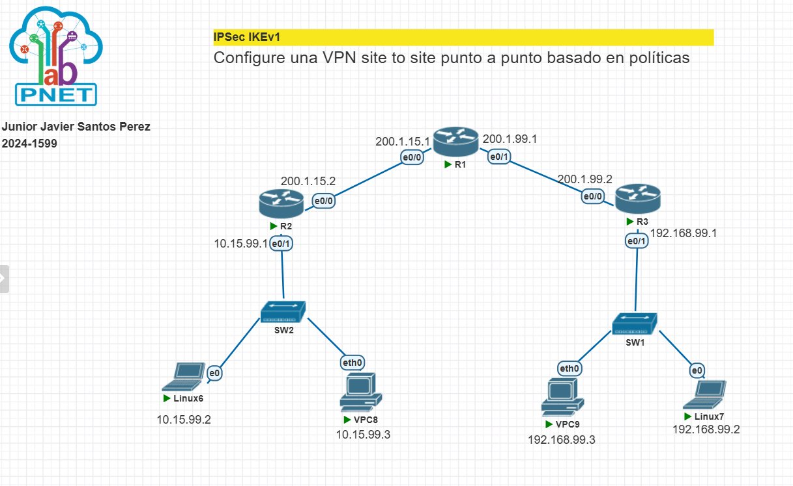

> Topología implementada en PNETLab. R1 actúa como ISP de tránsito. R2 y R3 son los peers VPN. SW1 y SW2 son los switches de acceso de cada LAN. Linux6, Linux7, VPC8 y VPC9 son los hosts clientes.

### Dispositivos y direccionamiento IP

| Dispositivo | Rol | Interfaz | Dirección IP | Gateway |
|---|---|---|---|---|
| R1 (ISP) | Router de tránsito | e0/0 | 200.1.15.1/24 | — |
| R1 (ISP) | Router de tránsito | e0/1 | 200.1.99.1/24 | — |
| R2 | Peer 1 — Extremo LAN A | e0/0 | 200.1.15.2/24 | — |
| R2 | Peer 1 — Extremo LAN A | e0/1 | 10.15.99.1/24 | — |
| R3 | Peer 2 — Extremo LAN B | e0/0 | 200.1.99.2/24 | — |
| R3 | Peer 2 — Extremo LAN B | e0/1 | 192.168.99.1/24 | — |
| SW2 | Switch acceso LAN A | — | — | — |
| SW1 | Switch acceso LAN B | — | — | — |
| Linux6 | Host LAN A | e0 | 10.15.99.2/24 | 10.15.99.1 |
| VPC8 | Host LAN A | eth0 | 10.15.99.3/24 | 10.15.99.1 |
| Linux7 | Host LAN B | e0 | 192.168.99.2/24 | 192.168.99.1 |
| VPC9 | Host LAN B | eth0 | 192.168.99.3/24 | 192.168.99.1 |

### Enrutamiento estático

| Router | Red destino | Máscara | Next-Hop | Propósito |
|---|---|---|---|---|
| R2 | 192.168.99.0 | /24 | 200.1.15.1 | Alcanzar LAN B vía ISP |
| R2 | 200.1.99.0 | /24 | 200.1.15.1 | Alcanzar WAN de R3 vía ISP |
| R3 | 10.15.99.0 | /24 | 200.1.99.1 | Alcanzar LAN A vía ISP |
| R3 | 200.1.15.0 | /24 | 200.1.99.1 | Alcanzar WAN de R2 vía ISP |
| R1 | 10.15.99.0 | /24 | 200.1.15.2 | Reenviar tráfico LAN A |
| R1 | 192.168.99.0 | /24 | 200.1.99.2 | Reenviar tráfico LAN B |

---

## Parámetros de seguridad IPSec IKEv1

| Parámetro | Valor | Justificación |
|---|---|---|
| Protocolo IKE | IKEv1 | Versión clásica, ampliamente soportada |
| Cifrado Fase 1 | AES-256 | Cifrado simétrico de 256 bits, alto nivel de seguridad |
| Hash / Integridad | SHA-256 | Función de hash segura, resistente a colisiones |
| Autenticación | Pre-Shared Key (PSK) | Clave compartida entre ambos peers |
| Grupo Diffie-Hellman | Grupo 14 (2048 bits) | Intercambio de claves con 2048 bits de seguridad |
| Lifetime Fase 1 | 86400 segundos (24h) | Tiempo de vida de la ISAKMP SA |
| Transform Set | ESP-AES-256 + ESP-SHA256-HMAC | Cifrado + integridad del tráfico de datos |
| Modo del túnel | Tunnel | Encapsula el paquete IP original completo |
| Pre-shared Key | `1599vpn` | Clave de autenticación entre R2 y R3 |
| Peer R2 | 200.1.15.2 | Dirección WAN local de R2 |
| Peer R3 | 200.1.99.2 | Dirección WAN local de R3 |

---

## Scripts de configuración

### R1 — Router ISP

```
enable
configure terminal
hostname R-ISP
!
interface ethernet 0/0
 ip address 200.1.15.1 255.255.255.0
 no shutdown
!
interface ethernet 0/1
 ip address 200.1.99.1 255.255.255.0
 no shutdown
!
ip route 10.15.99.0 255.255.255.0 200.1.15.2
ip route 192.168.99.0 255.255.255.0 200.1.99.2
!
end
write memory
```

### R2 — Peer 1 (Extremo LAN A)

```
enable
configure terminal
hostname R2
!
interface ethernet 0/0
 ip address 200.1.15.2 255.255.255.0
 no shutdown
!
interface ethernet 0/1
 ip address 10.15.99.1 255.255.255.0
 no shutdown
!
ip route 192.168.99.0 255.255.255.0 200.1.15.1
ip route 200.1.99.0 255.255.255.0 200.1.15.1
!
! === FASE 1 — ISAKMP Policy ===
crypto isakmp policy 10
 encr aes 256
 hash sha256
 authentication pre-share
 group 14
 lifetime 86400
exit
!
! === Pre-shared Key ===
crypto isakmp key 1599vpn address 200.1.99.2
!
! === FASE 2 — Transform Set ===
crypto ipsec transform-set TS-1599 esp-aes 256 esp-sha256-hmac
 mode tunnel
exit
!
! === ACL — Tráfico interesante ===
ip access-list extended ACL-VPN-1599
 permit ip 10.15.99.0 0.0.0.255 192.168.99.0 0.0.0.255
exit
!
! === Crypto Map ===
crypto map CMAP-1599 10 ipsec-isakmp
 set peer 200.1.99.2
 set transform-set TS-1599
 match address ACL-VPN-1599
exit
!
! === Aplicar en interfaz WAN ===
interface ethernet 0/0
 crypto map CMAP-1599
exit
!
end
write memory
```

### R3 — Peer 2 (Extremo LAN B)

```
enable
configure terminal
hostname R3
!
interface ethernet 0/0
 ip address 200.1.99.2 255.255.255.0
 no shutdown
!
interface ethernet 0/1
 ip address 192.168.99.1 255.255.255.0
 no shutdown
!
ip route 10.15.99.0 255.255.255.0 200.1.99.1
ip route 200.1.15.0 255.255.255.0 200.1.99.1
!
! === FASE 1 — ISAKMP Policy ===
crypto isakmp policy 10
 encr aes 256
 hash sha256
 authentication pre-share
 group 14
 lifetime 86400
exit
!
! === Pre-shared Key ===
crypto isakmp key 1599vpn address 200.1.15.2
!
! === FASE 2 — Transform Set ===
crypto ipsec transform-set TS-1599 esp-aes 256 esp-sha256-hmac
 mode tunnel
exit
!
! === ACL — Tráfico interesante ===
ip access-list extended ACL-VPN-1599
 permit ip 192.168.99.0 0.0.0.255 10.15.99.0 0.0.0.255
exit
!
! === Crypto Map ===
crypto map CMP-1599 10 ipsec-isakmp
 set peer 200.1.15.2
 set transform-set TS-1599
 match address ACL-VPN-1599
exit
!
! === Aplicar en interfaz WAN ===
interface ethernet 0/0
 crypto map CMP-1599
exit
!
end
write memory
```

---

## Capturas de configuración y verificación

### 1. Configuración crypto R2 — `show running-config | section crypto`

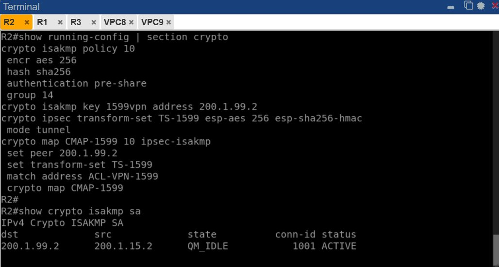

Se puede observar la configuración completa del crypto en R2:
- `crypto isakmp policy 10` con AES-256, SHA-256, grupo 14.
- `crypto isakmp key 1599vpn address 200.1.99.2` — PSK apuntando al peer remoto R3.
- `crypto map CMAP-1599` aplicado en la interfaz `Ethernet0/0`.
- `show crypto isakmp sa` muestra estado **QM_IDLE — ACTIVE** confirmando que la **Fase 1** fue negociada exitosamente.

---

### 2. R2 — `show crypto ipsec sa` (Fase 2)

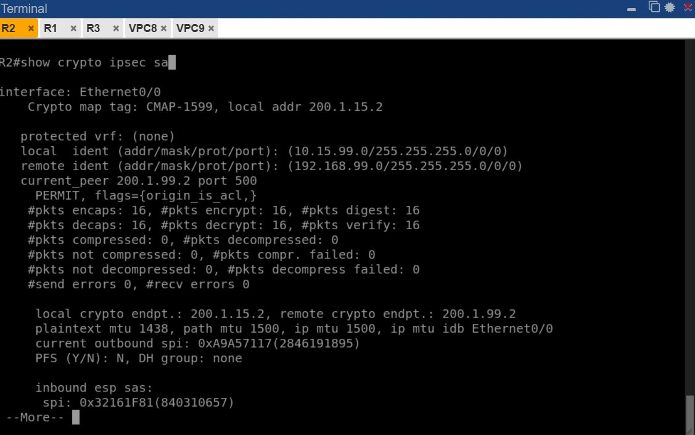

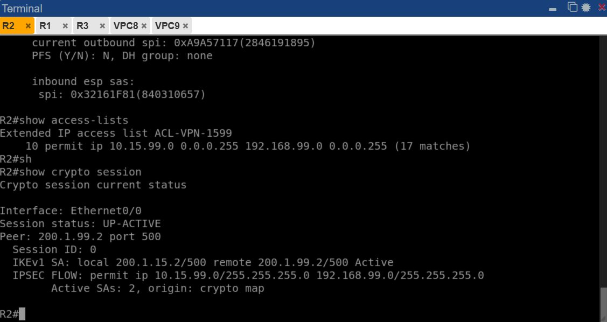

El comando `show crypto ipsec sa` confirma el establecimiento de la **Fase 2**:
- `local ident: 10.15.99.0/255.255.255.0` — red origen protegida.
- `remote ident: 192.168.99.0/255.255.255.0` — red destino protegida.
- `current_peer 200.1.99.2 port 500` — peer remoto activo.
- `#pkts encaps: 16, #pkts encrypt: 16` — 16 paquetes cifrados correctamente.
- `#pkts decaps: 16, #pkts decrypt: 16` — 16 paquetes descifrados correctamente.
- `Session status: UP-ACTIVE` con `Active SAs: 2` — dos SAs activas (inbound + outbound).
- ACL `ACL-VPN-1599` con **17 matches** — tráfico interesante detectado y procesado.

---

### 3. R2 — `show ip route`

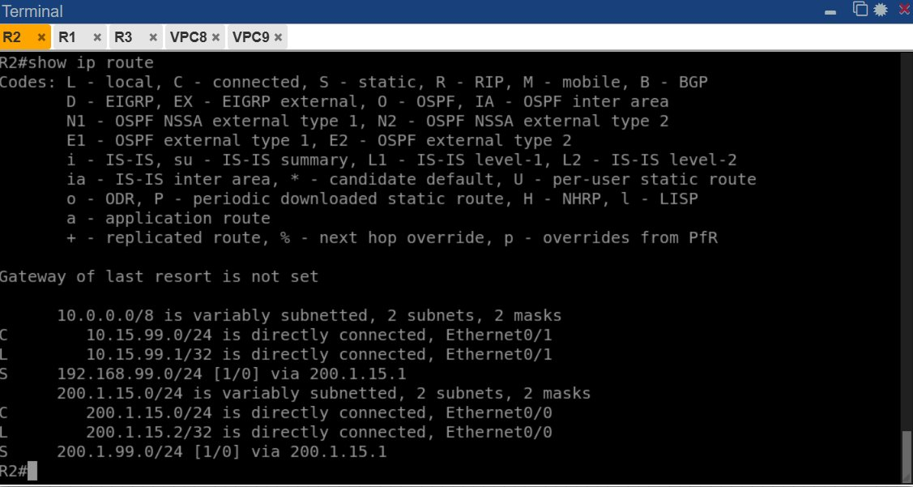

La tabla de enrutamiento de R2 muestra:
- `C 10.15.99.0/24` — conectada directamente en `Ethernet0/1` (LAN A).
- `S 192.168.99.0/24 via 200.1.15.1` — ruta estática hacia LAN B a través del ISP.
- `S 200.1.99.0/24 via 200.1.15.1` — ruta hacia la WAN de R3 a través del ISP.

---

### 4. R1 (ISP) — `show ip route`

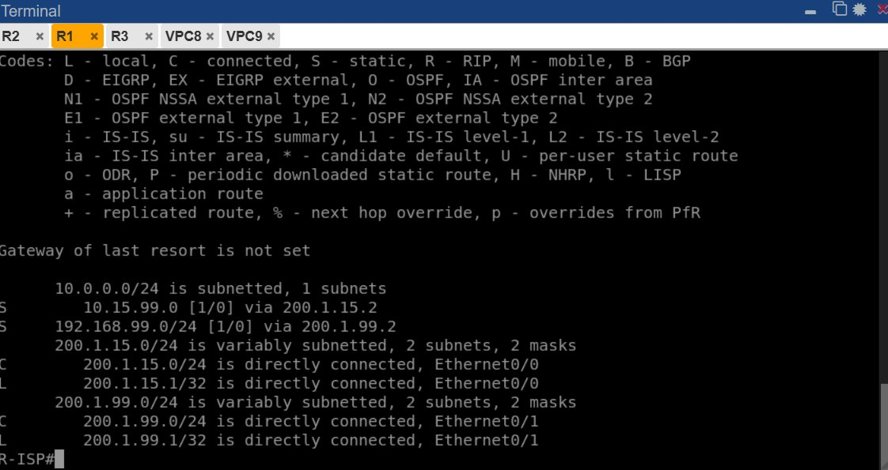

El ISP tiene rutas estáticas hacia ambas LANs privadas:
- `S 10.15.99.0/24 via 200.1.15.2` — hacia LAN A a través de R2.
- `S 192.168.99.0/24 via 200.1.99.2` — hacia LAN B a través de R3.
- Las interfaces `Ethernet0/0` y `Ethernet0/1` están directamente conectadas.

---

### 5. R1 (ISP) — Configuración de interfaces

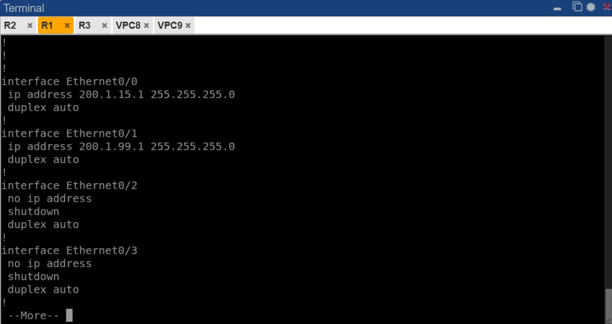

Confirma las interfaces del ISP configuradas correctamente:
- `Ethernet0/0: 200.1.15.1/24` — enlace hacia R2.
- `Ethernet0/1: 200.1.99.1/24` — enlace hacia R3.

---

### 6. R3 — `show crypto session`, `show access-lists` y `show crypto isakmp sa`

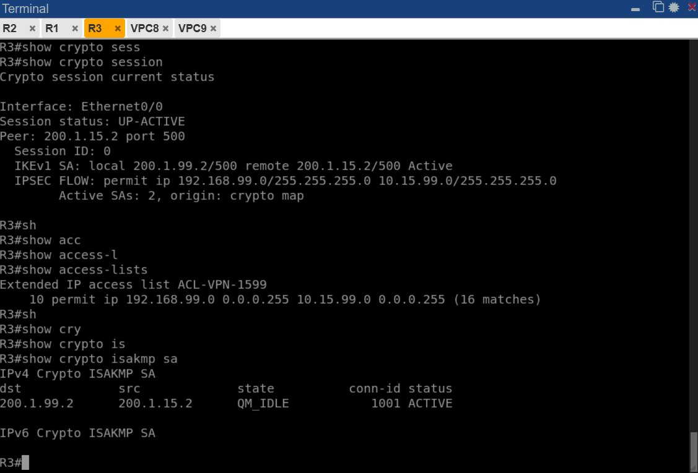

Verificación desde el lado de R3:
- `Session status: UP-ACTIVE` — sesión activa en R3.
- `IKEv1 SA: local 200.1.99.2/500 remote 200.1.15.2/500 Active` — Fase 1 activa.
- `IPSEC FLOW: permit ip 192.168.99.0/255.255.255.0 10.15.99.0/255.255.255.0` — flujo correcto.
- ACL `ACL-VPN-1599` con **16 matches** — tráfico interesante procesado.
- `QM_IDLE — ACTIVE` — Fase 1 negociada exitosamente desde R3.

---

### 7. R3 — `show crypto ipsec sa`

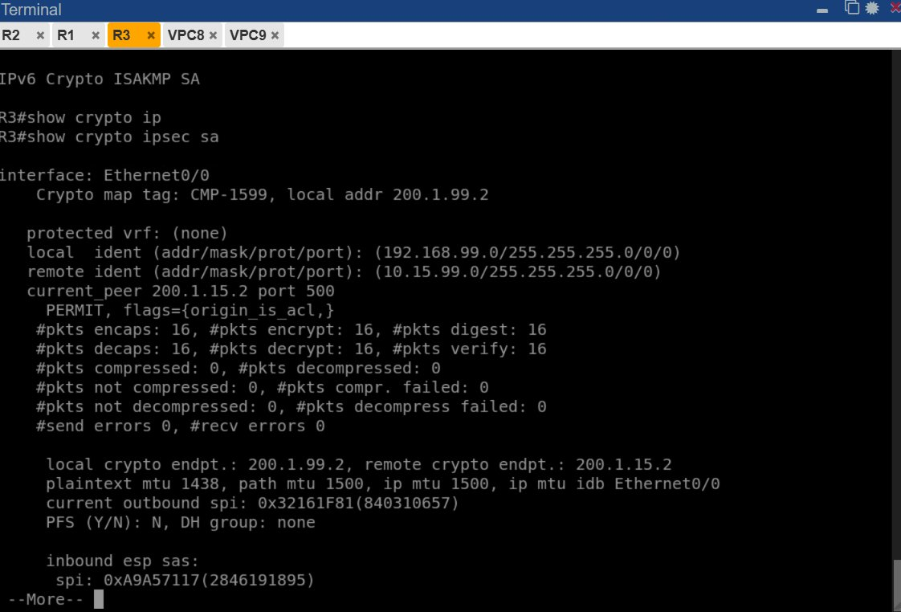

Desde R3 se confirma:
- Crypto map `CMP-1599` activo en `Ethernet0/0`.
- `local ident: 192.168.99.0` — red origen de R3.
- `remote ident: 10.15.99.0` — red destino (LAN A).
- `#pkts encaps: 16, #pkts encrypt: 16` — paquetes cifrados hacia R2.
- `#pkts decaps: 16, #pkts decrypt: 16` — paquetes descifrados desde R2.
- SPI inbound y outbound activos — SAs simétricas establecidas.

---

### 8. R3 — `show ip route`

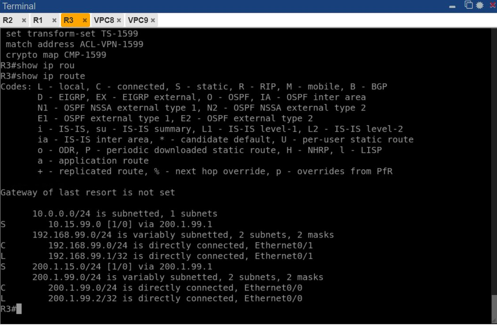

Tabla de enrutamiento de R3:
- `C 192.168.99.0/24` — conectada directamente en `Ethernet0/1` (LAN B).
- `S 10.15.99.0/24 via 200.1.99.1` — ruta estática hacia LAN A a través del ISP.
- `S 200.1.15.0/24 via 200.1.99.1` — ruta hacia la WAN de R2 a través del ISP.

---

### 9. R3 — `show running-config | section crypto`

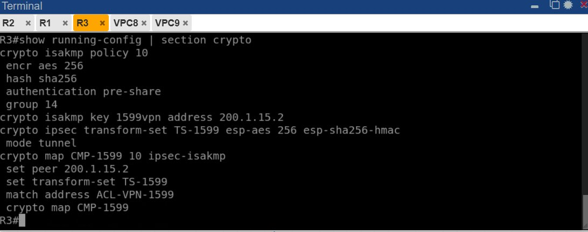

Confirma la configuración completa del crypto en R3:
- `crypto isakmp policy 10` con parámetros idénticos a R2.
- `crypto isakmp key 1599vpn address 200.1.15.2` — PSK apuntando al peer R2.
- `crypto map CMP-1599` con peer `200.1.15.2` y transform-set `TS-1599`.

---

## Pruebas de conectividad

### VPC8 (LAN A) → VPC9 (LAN B)

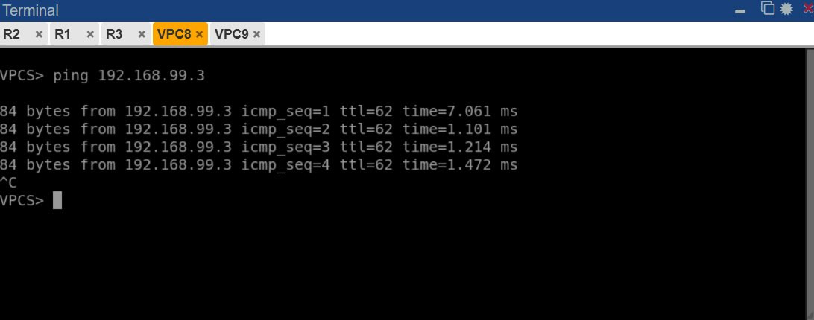

`ping 192.168.99.3` ejecutado desde VPC8 (`10.15.99.3`) hacia VPC9 (`192.168.99.3`):
- 4 respuestas exitosas con TTL=62.
- TTL=62 indica que el paquete atraviesa 2 routers (R2 → R3), confirmando que el tráfico pasa a través del túnel IPSec cifrado.
- Tiempo de respuesta estable: ~1-7 ms.

---

### VPC9 (LAN B) → VPC8 (LAN A)

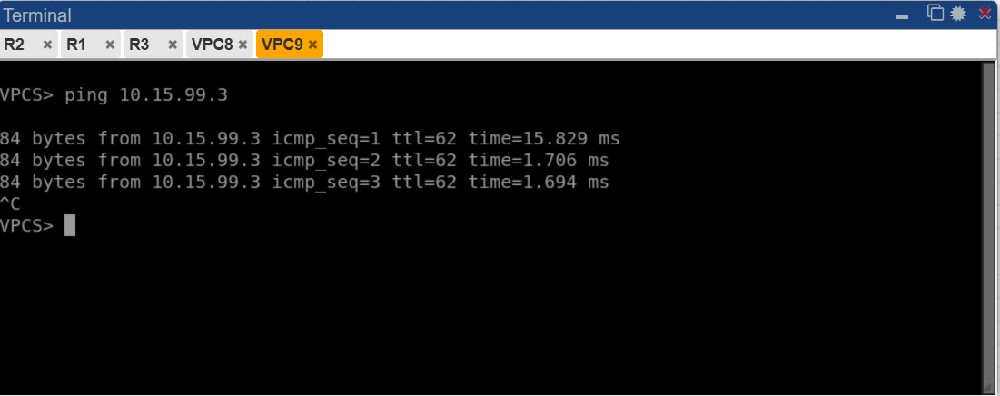

`ping 10.15.99.3` ejecutado desde VPC9 (`192.168.99.3`) hacia VPC8 (`10.15.99.3`):
- 3 respuestas exitosas con TTL=62.
- Conectividad bidireccional confirmada.
- El túnel IPSec IKEv1 funciona correctamente en ambas direcciones.

---

## Resumen de resultados

| Verificación | Comando | Resultado |
|---|---|---|
| Fase 1 R2 | `show crypto isakmp sa` | ✅ QM_IDLE — ACTIVE |
| Fase 1 R3 | `show crypto isakmp sa` | ✅ QM_IDLE — ACTIVE |
| Fase 2 R2 | `show crypto ipsec sa` | ✅ 16 pkts encaps/decrypt |
| Fase 2 R3 | `show crypto ipsec sa` | ✅ 16 pkts encaps/decrypt |
| Sesión R2 | `show crypto session` | ✅ UP-ACTIVE |
| Sesión R3 | `show crypto session` | ✅ UP-ACTIVE |
| ACL R2 | `show access-lists` | ✅ 17 matches |
| ACL R3 | `show access-lists` | ✅ 16 matches |
| Enrutamiento R2 | `show ip route` | ✅ Rutas estáticas correctas |
| Enrutamiento R3 | `show ip route` | ✅ Rutas estáticas correctas |
| Ping VPC8 → VPC9 | `ping 192.168.99.3` | ✅ Exitoso (TTL=62) |
| Ping VPC9 → VPC8 | `ping 10.15.99.3` | ✅ Exitoso (TTL=62) |
